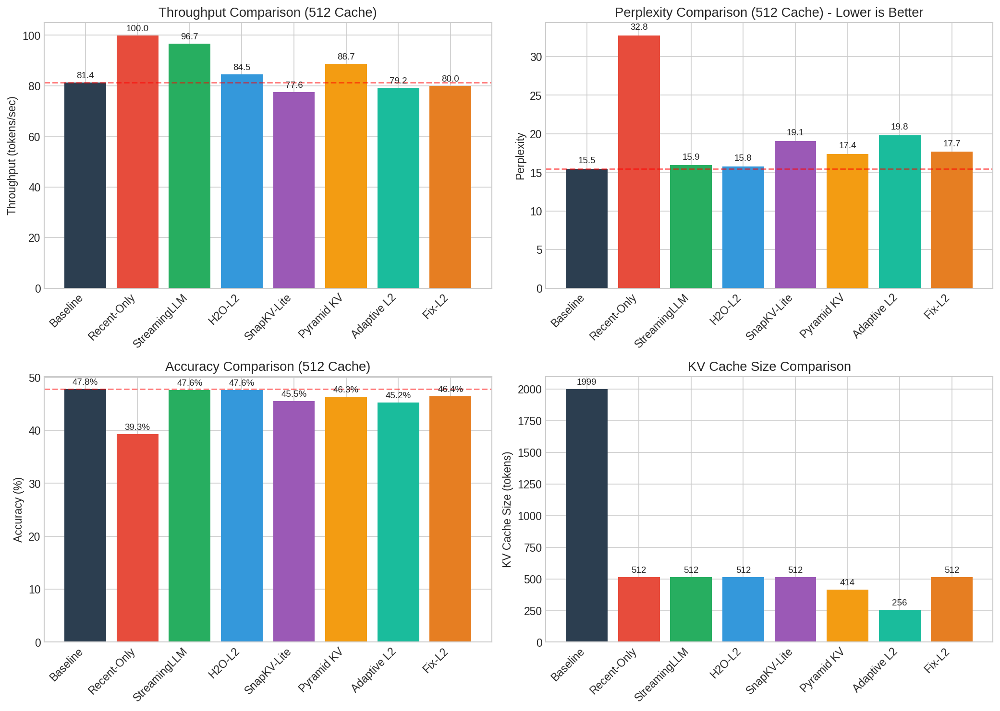
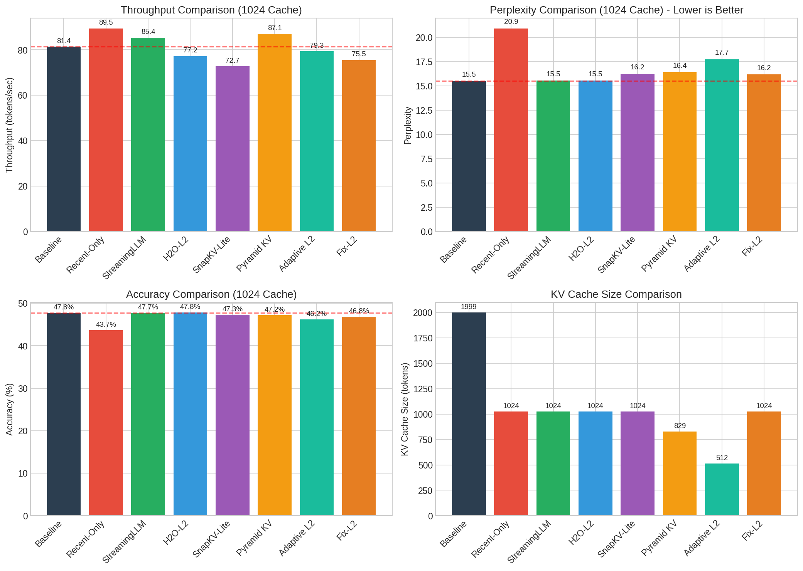
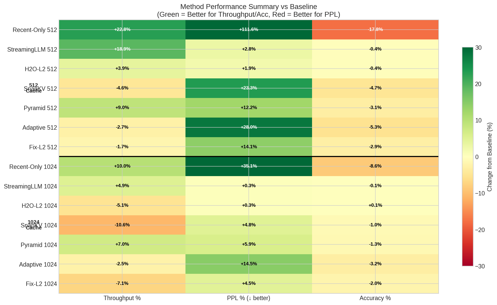
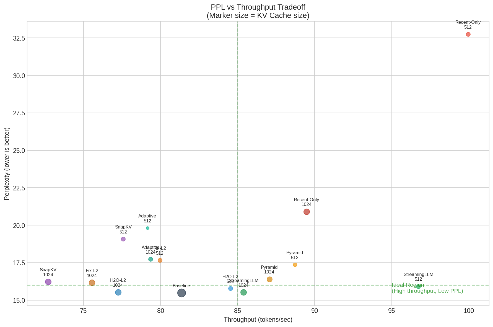
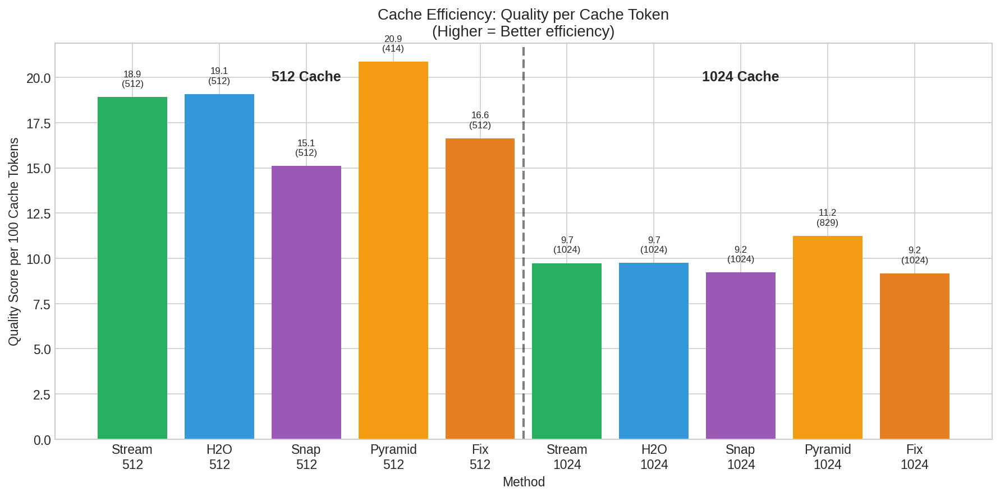

# CS3602 LLM Inference Acceleration

CS3602大作业：针对大型语言模型的KV Cache优化与推理加速。

本项目实现了多种 KV Cache 压缩方法，统一在 `kvcompress` 库中管理：

1. **L2 Compress (KnormPress)** - 基于 L2 范数的比例压缩
2. **Fix-Size L2** - 固定大小 KV Cache 压缩
3. **StreamingLLM** - 基于 Attention Sink 的流式压缩
4. **H2O-L2** - H2O 风格的 Heavy-Hitter 压缩（使用 L2 范数近似）
5. **SnapKV-Lite** - 基于观察窗口投票的压缩
6. **Pyramid KV** - 层级自适应压缩
7. **Adaptive L2** - 动态序列长度感知压缩
8. **Recent-Only** - 纯滑动窗口（对照组）

## 项目概述

KVCompress 是一个统一的 KV Cache 压缩库，支持多种压缩策略：

| 方法 | 说明 | 适用场景 |
|------|------|----------|
| `l2_compress` | 按 `keep_ratio` 比例压缩，保留低 L2 范数 token | 通用压缩 |
| `fix_size_l2_compress` | 维持固定 KV Cache 大小，支持多种驱逐策略 | 内存受限场景 |
| `streaming_llm_compress` | 保留 attention sinks + 最近 tokens | 无限长度流式输入 |
| `h2o_l2_compress` | Attention sinks + Heavy Hitters (L2) + Recent | 平衡质量与速度 |
| `snapkv_lite_compress` | 观察窗口投票 + 重要性选择 | 上下文感知压缩 |
| `pyramid_kv_compress` | 层级自适应压缩（低层多，高层少） | 层级优化 |
| `adaptive_l2_compress` | 根据序列长度动态调整压缩率 | 变长输入场景 |
| `recent_only_compress` | 纯滑动窗口，保留最近 N 个 tokens | 对照组基线 |

### StreamingLLM 方法

StreamingLLM 是来自 MIT Han Lab 的方法（ICLR 2024），核心发现是：

- LLM 会将大量 attention 分配给初始 tokens（"attention sinks"），即使它们语义上不重要
- 通过保留这些 attention sinks + 滑动窗口的最近 tokens，可以处理无限长度的输入

```
Cache 结构: [initial tokens (0:start_size)] + [recent tokens (seq_len-recent_size:seq_len)]
默认配置: 4 initial tokens + 508 recent tokens = 512 total
```

## 项目结构

```
.
├── README.md                    # 项目说明文档
├── LICENSE                      # 许可证
├── results.txt                  # 实验结果日志
│
├── docs/                        # 📚 文档
│   ├── lab-instruction.md       # 作业要求
│   ├── KnormPress.pdf           # KnormPress 论文
│   └── L2_COMPRESS_ANALYSIS.md  # 压缩效果分析
│
├── data/                        # 📊 数据集
│   └── pg19.parquet             # PG-19 长文本数据集
│
├── kvcompress/                  # 🧠 核心压缩库 ⭐
│   ├── __init__.py              # 统一导出
│   ├── methods/                 # 压缩方法
│   │   ├── __init__.py          # 方法注册表
│   │   ├── base.py              # 基类和接口
│   │   ├── l2_compress.py       # KnormPress L2 压缩
│   │   ├── fix_size_l2.py       # 固定大小 L2 压缩
│   │   ├── streaming_llm.py     # StreamingLLM 方法
│   │   ├── h2o_l2.py            # H2O-L2 压缩
│   │   ├── snapkv_lite.py       # SnapKV-Lite 压缩
│   │   ├── pyramid_kv.py        # Pyramid KV 压缩
│   │   ├── adaptive_l2.py       # Adaptive L2 压缩
│   │   └── recent_only.py       # Recent-Only 对照组
│   ├── evaluate.py              # 统一评估模块
│   ├── benchmark.py             # 统一基准测试模块
│   └── utils.py                 # 工具函数
│
├── scripts/                     # 🛠️ 工具脚本
│   ├── benchmark.py             # 统一基准测试入口 ⭐
│   └── plot_comprehensive_results.py  # 可视化绘图
│
├── baseline_test.py             # 基线性能测试
│
└── results/                     # 📈 结果图表
    ├── methods_512_comparison.png   # 512 Cache 方法对比
    ├── methods_1024_comparison.png  # 1024 Cache 方法对比
    ├── ppl_throughput_tradeoff.png  # PPL-吞吐量权衡图
    ├── method_summary_heatmap.png   # 方法总结热力图
    └── cache_efficiency.png         # Cache 效率对比
```

## 环境配置

### 依赖安装

```bash
# 创建并激活 conda 环境
conda create -n nlp python=3.11
conda activate nlp

# 安装依赖
pip install torch transformers datasets numpy tqdm matplotlib
```

### 模型和数据集

- **模型**: `EleutherAI/pythia-2.8b`
- **数据集**: `PG-19` (长文本), `wikitext-2-raw-v1` (短文本)

## 使用方法

### 1. 统一基准测试（推荐）

```bash
# 测试 L2 压缩（KnormPress）
python scripts/benchmark.py --method l2_compress --keep_ratios 1.0,0.8,0.5

# 测试固定大小 L2 压缩
python scripts/benchmark.py --method fix_size_l2 --fix_kv_sizes 256,512 --strategies keep_low

# 测试 StreamingLLM
python scripts/benchmark.py --method streaming_llm --start_size 4 --recent_sizes 252,508,1020

# 测试 H2O-L2
python scripts/benchmark.py --method h2o_l2 --heavy_hitter_sizes 32,64,128

# 测试 SnapKV-Lite
python scripts/benchmark.py --method snapkv_lite --observation_windows 16,32,64

# 测试 Pyramid KV
python scripts/benchmark.py --method pyramid_kv --base_sizes 256,512

# 测试 Adaptive L2
python scripts/benchmark.py --method adaptive_l2 --target_sizes 256,512

# 对比所有方法 (512 和 1024 cache size，含对照组)
python scripts/benchmark.py --compare_all
```

### 2. 在代码中使用

```python
from kvcompress import (
    l2_compress, 
    fix_size_l2_compress, 
    streaming_llm_compress,
    h2o_l2_compress,
    snapkv_lite_compress,
    pyramid_kv_compress,
    adaptive_l2_compress,
    evaluate_with_compression
)

# 方法1: L2 比例压缩 (KnormPress)
compressed_kv = l2_compress(
    past_key_values,
    keep_ratio=0.8,      # 保留 80%
    prune_after=1000,    # 超过 1000 token 才压缩
    skip_layers=[0, 1]   # 跳过前两层
)

# 方法2: 固定大小压缩
compressed_kv = fix_size_l2_compress(
    past_key_values,
    fix_kv_size=512,       # 最多保留 512 token
    keep_ratio=0.2,        # 最近 20% 不驱逐
    strategy="keep_low",   # 保留低范数 token
    skip_layers=[0, 1]
)

# 方法3: StreamingLLM
compressed_kv = streaming_llm_compress(
    past_key_values,
    start_size=4,          # 保留 4 个 attention sink tokens
    recent_size=508,       # 保留最近 508 个 tokens
)

# 方法4: H2O-L2
compressed_kv = h2o_l2_compress(
    past_key_values,
    start_size=4,          # 4 attention sinks
    heavy_hitter_size=64,  # 64 heavy hitters
    recent_size=444,       # 444 recent tokens
)

# 使用统一评估接口
results = evaluate_with_compression(
    model, tokenizer, text,
    compress_fn=streaming_llm_compress,
    compress_kwargs={"start_size": 4, "recent_size": 508}
)
print(f"PPL: {results['perplexity']:.2f}, Acc: {results['accuracy']:.2%}")
```

### 3. 使用方法注册表

```python
from kvcompress import get_compress_fn, list_methods

# 查看所有可用方法
print(list_methods())
# ['l2_compress', 'fix_size_l2', 'streaming_llm', 'h2o_l2', 'snapkv_lite', 'pyramid_kv', 'adaptive_l2', 'recent_only']

# 通过名称获取压缩函数
compress_fn = get_compress_fn("streaming_llm")
compressed = compress_fn(past_key_values, start_size=4, recent_size=508)
```

## 核心算法

### l2_compress (比例压缩)

```
输入: KV Cache (seq_len tokens), keep_ratio
输出: 压缩后的 KV Cache (seq_len * keep_ratio tokens)

1. 计算每个 token 的 L2 范数
2. 按范数升序排序
3. 保留前 keep_ratio 比例的低范数 token
4. 恢复时间顺序
```

### fix_size_l2_compress (固定大小)

```
输入: KV Cache, fix_kv_size, keep_ratio
输出: 最多 fix_kv_size tokens 的 KV Cache

1. 如果 seq_len <= fix_kv_size，不压缩
2. 计算保护区大小: protected = fix_kv_size * keep_ratio
3. 驱逐区 = 前 (seq_len - protected) 个 token
4. 从驱逐区选择 (fix_kv_size - protected) 个 token 保留
5. 合并: 保留的驱逐区 token + 保护区 token
```

### streaming_llm_compress (StreamingLLM)

```
输入: KV Cache, start_size, recent_size
输出: 最多 (start_size + recent_size) tokens 的 KV Cache

1. 如果 seq_len <= (start_size + recent_size)，不压缩
2. 保留 attention sinks: tokens[0:start_size]
3. 保留最近 tokens: tokens[-recent_size:]
4. 拼接: attention sinks + recent tokens
```

### h2o_l2_compress (H2O-L2)

H2O-inspired 方法，使用 L2 范数作为 attention 重要性的近似。

```
输入: KV Cache, start_size, heavy_hitter_size, recent_size
输出: 最多 (start_size + heavy_hitter_size + recent_size) tokens

Cache 结构: [attention sinks] + [heavy hitters (低L2范数)] + [recent window]

1. 保留 start_size 个初始 tokens (attention sinks)
2. 从中间区域选择 heavy_hitter_size 个低 L2 范数 tokens
3. 保留 recent_size 个最近 tokens
4. 按时间顺序拼接
```

### snapkv_lite_compress (SnapKV-Lite)

基于观察窗口投票的压缩方法。

```
输入: KV Cache, observation_window, keep_size
输出: 最多 keep_size tokens

1. 使用最后 observation_window 个 tokens 作为观察上下文
2. 计算 prefix tokens 的重要性分数 (L2 norm inverted)
3. 应用 pooling 平滑重要性分数
4. 选择 top-k 最重要的 prefix tokens
5. 拼接: selected prefix + observation window
```

### pyramid_kv_compress (Pyramid KV)

层级自适应压缩，不同层使用不同的压缩率。

```
输入: KV Cache, base_size, layer_decay, profile
输出: 每层不同大小的 KV Cache

Layer i 的 cache size = base_size * (layer_decay ^ i)
- 低层: 保留更多 tokens (捕获局部模式)
- 高层: 保留更少 tokens (更冗余)
```

### adaptive_l2_compress (Adaptive L2)

根据序列长度动态调整压缩策略。

```
输入: KV Cache, target_size, soft_limit, hard_limit
输出: 动态大小的 KV Cache

压缩策略:
- seq_len <= soft_limit: 不压缩
- soft_limit < seq_len <= hard_limit: 渐进压缩
- seq_len > hard_limit: 压缩到 target_size
```

### recent_only_compress (对照组)

纯滑动窗口，仅保留最近的 N 个 tokens。

```
输入: KV Cache, window_size
输出: 最多 window_size tokens 的 KV Cache

1. 如果 seq_len <= window_size，不压缩
2. 保留最近 window_size 个 tokens
```

## 实验结果

### Pythia-2.8B 综合基准测试

**测试配置**:
- 模型: `EleutherAI/pythia-2.8b`
- 数据集: PG-19 长文本
- 评估 tokens: 2000
- 设备: CUDA GPU
- Cache Size: 512 和 1024

### 512 Cache Size 对比

| 方法 | TTFT(s) | TPOT(s) | 吞吐量 | PPL | Accuracy | KV Cache Size |
|------|---------|---------|--------|-----|----------|---------------|
| **Baseline** | 0.0251 | 0.0122 | 81.36 | 15.48 | 47.77% | 1999 |
| Recent-Only 512 | 0.0085 | 0.0098 | 99.95 | 32.75 | 39.27% | 512 |
| **StreamingLLM 512** | 0.0084 | 0.0102 | 96.73 | 15.92 | 47.57% | 512 |
| **H2O-L2 512** | 0.0086 | 0.0116 | 84.53 | 15.78 | 47.57% | 512 |
| SnapKV-Lite 512 | 0.0086 | 0.0127 | 77.58 | 19.08 | 45.52% | 512 |
| Pyramid KV 512 | 0.0085 | 0.0111 | 88.71 | 17.37 | 46.30% | ~414 |
| Adaptive L2 512 | 0.0084 | 0.0125 | 79.15 | 19.82 | 45.25% | ~256 |
| Fix-Size L2 512 | 0.0086 | 0.0123 | 79.95 | 17.66 | 46.40% | 512 |



### 1024 Cache Size 对比

| 方法 | TTFT(s) | TPOT(s) | 吞吐量 | PPL | Accuracy | KV Cache Size |
|------|---------|---------|--------|-----|----------|---------------|
| **Baseline** | 0.0251 | 0.0122 | 81.36 | 15.48 | 47.77% | 1999 |
| Recent-Only 1024 | 0.0085 | 0.0110 | 89.47 | 20.91 | 43.67% | 1024 |
| **StreamingLLM 1024** | 0.0088 | 0.0115 | 85.38 | 15.52 | 47.72% | 1024 |
| **H2O-L2 1024** | 0.0084 | 0.0128 | 77.24 | 15.53 | 47.82% | 1024 |
| SnapKV-Lite 1024 | 0.0085 | 0.0136 | 72.71 | 16.23 | 47.27% | 1024 |
| Pyramid KV 1024 | 0.0085 | 0.0113 | 87.06 | 16.40 | 47.17% | ~829 |
| Adaptive L2 1024 | 0.0084 | 0.0124 | 79.35 | 17.73 | 46.22% | ~512 |
| Fix-Size L2 1024 | 0.0084 | 0.0130 | 75.55 | 16.17 | 46.80% | 1024 |



### 与 Baseline 对比

#### 512 Cache Size

| 方法 | 吞吐量变化 | TPOT 提升 | PPL 变化 | Accuracy 变化 | 评价 |
|------|-----------|----------|---------|--------------|------|
| Recent-Only 512 | +22.8% | +19.4% | +111.5% ❌ | -17.8% ❌ | 对照组 |
| **StreamingLLM 512** | **+18.9%** | **+16.7%** | **+2.8%** | **-0.4%** | 🏆 最佳综合 |
| **H2O-L2 512** | +3.9% | +4.4% | **+1.9%** | **-0.4%** | ✅ 质量最佳 |
| SnapKV-Lite 512 | -4.7% | -4.2% | +23.2% | -4.7% | 需优化 |
| Pyramid KV 512 | +9.0% | +9.1% | +12.2% | -3.1% | 层级优化 |
| Adaptive L2 512 | -2.7% | -2.6% | +28.0% | -5.3% | 动态压缩 |
| Fix-Size L2 512 | -1.7% | -1.1% | +14.1% | -2.9% | 固定大小 |

#### 1024 Cache Size

| 方法 | 吞吐量变化 | TPOT 提升 | PPL 变化 | Accuracy 变化 | 评价 |
|------|-----------|----------|---------|--------------|------|
| Recent-Only 1024 | +10.0% | +9.8% | +35.1% ❌ | -8.6% ❌ | 对照组 |
| **StreamingLLM 1024** | +4.9% | +5.4% | **+0.3%** | **-0.1%** | 🏆 质量最佳 |
| **H2O-L2 1024** | -5.1% | -4.7% | **+0.3%** | **+0.1%** | ✅ 质量最佳 |
| SnapKV-Lite 1024 | -10.6% | -11.3% | +4.8% | -1.0% | 上下文感知 |
| Pyramid KV 1024 | +7.0% | +7.3% | +5.9% | -1.3% | 层级优化 |
| Adaptive L2 1024 | -2.5% | -1.9% | +14.5% | -3.2% | 动态压缩 |
| Fix-Size L2 1024 | -7.1% | -7.1% | +4.4% | -2.0% | 固定大小 |

### 可视化分析

#### 方法性能总结热力图



#### PPL vs 吞吐量权衡



#### Cache 效率对比



### 关键发现

🏆 **最佳方法: StreamingLLM**
- **StreamingLLM-512**: 吞吐量提升 18.9%，PPL 仅增加 2.8%，Accuracy 几乎无损失 (-0.4%)
- **StreamingLLM-1024**: 质量几乎与 Baseline 相同，PPL 仅增加 0.3%

✅ **H2O-L2 表现突出**:
- **H2O-L2-512**: PPL 仅增加 1.9%（512 方法中最低）
- **H2O-L2-1024**: PPL 仅增加 0.3%，Accuracy 甚至略有提升 (+0.1%)
- 通过保留 attention sinks + heavy hitters + recent tokens 实现更好的信息保留

⚠️ **Recent-Only 对照组**:
- **Recent-Only-512**: PPL 增加 111.5%，Accuracy 下降 17.8%
- **Recent-Only-1024**: PPL 增加 35.1%，Accuracy 下降 8.6%
- 说明保留 attention sinks 的重要性

📊 **其他方法分析**:
- **Pyramid KV**: 吞吐量提升 7-9%，PPL 增加 6-12%，适合层级优化
- **SnapKV-Lite**: 1024 配置下质量较好 (PPL +4.8%)，但吞吐量下降
- **Adaptive L2**: 动态压缩，适合变长输入场景

## 参考文献

- **KnormPress**: [A Simple and Effective L2 Norm-Based Strategy for KV Cache Compression](https://arxiv.org/abs/2406.11430) (EMNLP 2024)
- **StreamingLLM**: [Efficient Streaming Language Models with Attention Sinks](https://arxiv.org/abs/2309.17453) (ICLR 2024)
- **H2O**: [Heavy-Hitter Oracle for Efficient Generative Inference of Large Language Models](https://arxiv.org/abs/2306.14048) (NeurIPS 2023)
- **SnapKV**: [LLM Knows What You are Looking for Before Generation](https://arxiv.org/abs/2404.14469) (2024)
- **PyramidKV**: [Dynamic KV Cache Compression based on Pyramidal Information Funneling](https://arxiv.org/abs/2406.02069) (2024)
- **Pythia 模型**: [EleutherAI/pythia-2.8b](https://huggingface.co/EleutherAI/pythia-2.8b)

## 总结

本项目实现了统一的 KV Cache 压缩库 `kvcompress`：

✅ **8 种压缩方法**: l2_compress, fix_size_l2, streaming_llm, h2o_l2, snapkv_lite, pyramid_kv, adaptive_l2, recent_only  
✅ **统一接口**: 所有方法使用相同的函数签名  
✅ **方法注册表**: 方便扩展新方法  
✅ **统一评估**: 支持 PPL, Accuracy, TTFT, TPOT  
✅ **统一基准测试**: 单一脚本测试所有方法

### 实验结论

基于 Pythia-2.8B 模型的测试结果：

| 推荐场景 | 推荐方法 | Cache Size | 效果 |
|---------|---------|------------|------|
| 质量优先 | StreamingLLM-1024 / H2O-L2-1024 | 1024 | PPL +0.3%, Acc -0.1% |
| 平衡方案 | StreamingLLM-512 | 512 | 吞吐量 +18.9%, PPL +2.8% |
| 质量备选 | H2O-L2-512 | 512 | PPL +1.9%, Acc -0.4% |
| 层级优化 | Pyramid KV | 414~829 | 吞吐量 +7~9%, PPL +6~12% |
| 变长输入 | Adaptive L2 | 动态 | 根据输入长度自动调整 |

## 作者

Jiamin Liu

## 致谢

感谢 KnormPress、StreamingLLM、H2O、SnapKV、PyramidKV 论文作者提供的开源实现和详细文档。
