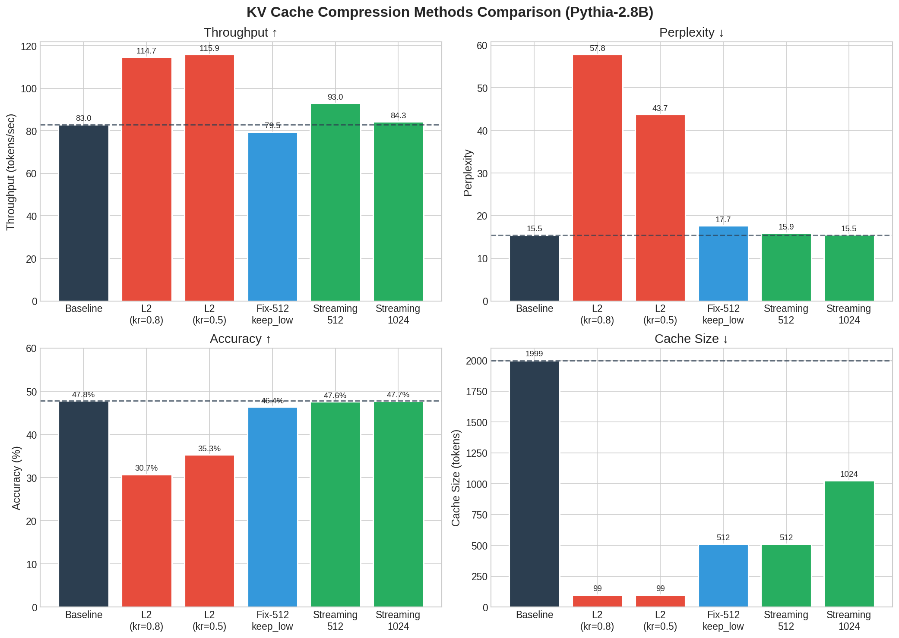
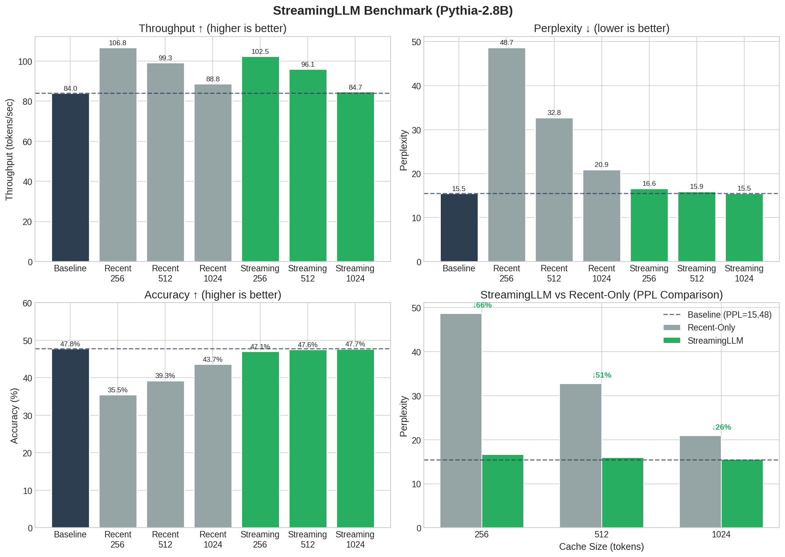
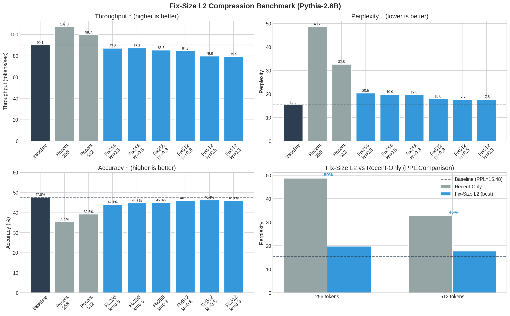
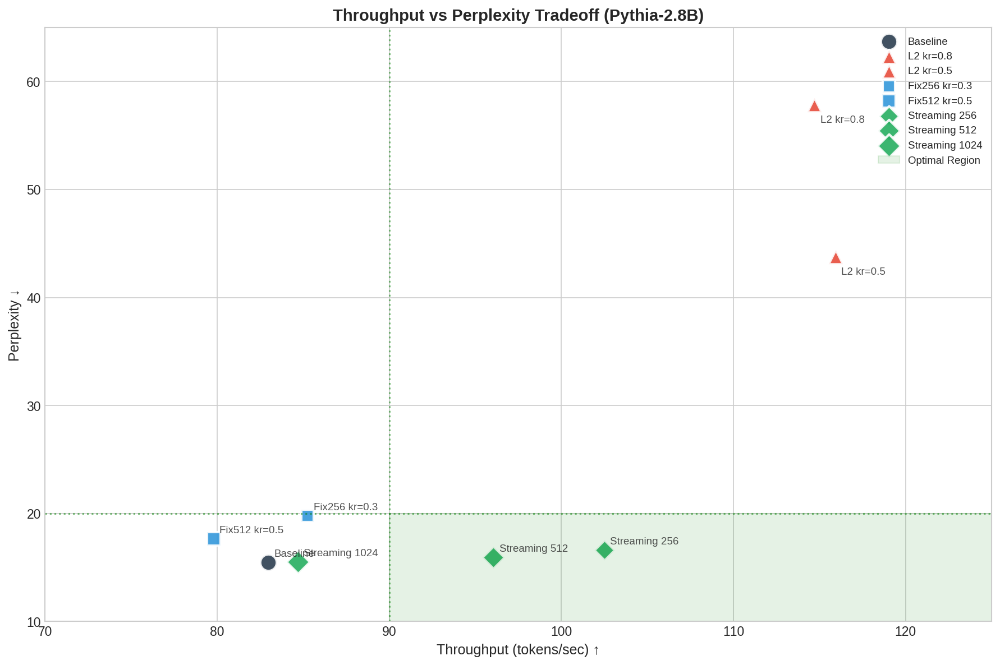

# CS3602 LLM Inference Acceleration

CS3602大作业：针对大型语言模型的KV Cache优化与推理加速。

本项目实现了多种 KV Cache 压缩方法，统一在 `kvcompress` 库中管理：

1. **L2 Compress (KnormPress)** - 基于 L2 范数的比例压缩
2. **Fix-Size L2** - 固定大小 KV Cache 压缩
3. **StreamingLLM** - 基于 Attention Sink 的流式压缩

## 项目概述

KVCompress 是一个统一的 KV Cache 压缩库，支持多种压缩策略：

| 方法 | 说明 | 适用场景 |
|------|------|----------|
| `l2_compress` | 按 `keep_ratio` 比例压缩，保留低 L2 范数 token | 通用压缩 |
| `fix_size_l2_compress` | 维持固定 KV Cache 大小，支持多种驱逐策略 | 内存受限场景 |
| `streaming_llm_compress` | 保留 attention sinks + 最近 tokens | 无限长度流式输入 |

### StreamingLLM 方法

StreamingLLM 是来自 MIT Han Lab 的方法（ICLR 2024），核心发现是：

- LLM 会将大量 attention 分配给初始 tokens（"attention sinks"），即使它们语义上不重要
- 通过保留这些 attention sinks + 滑动窗口的最近 tokens，可以处理无限长度的输入

```
Cache 结构: [initial tokens (0:start_size)] + [recent tokens (seq_len-recent_size:seq_len)]
默认配置: 4 initial tokens + 508 recent tokens = 512 total
```

## 项目结构

```
.
├── README.md                    # 项目说明文档
├── LICENSE                      # 许可证
├── results.txt                  # 实验结果日志
│
├── docs/                        # 📚 文档
│   ├── lab-instruction.md       # 作业要求
│   ├── KnormPress.pdf           # KnormPress 论文
│   └── L2_COMPRESS_ANALYSIS.md  # 压缩效果分析
│
├── data/                        # 📊 数据集
│   └── pg19.parquet             # PG-19 长文本数据集
│
├── kvcompress/                  # 🧠 核心压缩库 ⭐
│   ├── __init__.py              # 统一导出
│   ├── methods/                 # 压缩方法
│   │   ├── __init__.py          # 方法注册表
│   │   ├── base.py              # 基类和接口
│   │   ├── l2_compress.py       # KnormPress L2 压缩
│   │   ├── fix_size_l2.py       # 固定大小 L2 压缩
│   │   └── streaming_llm.py     # StreamingLLM 方法 ⭐
│   ├── evaluate.py              # 统一评估模块
│   ├── benchmark.py             # 统一基准测试模块
│   └── utils.py                 # 工具函数
│
├── scripts/                     # 🛠️ 工具脚本
│   ├── benchmark.py             # 统一基准测试入口 ⭐
│   └── plot_compression_results.py  # 可视化绘图
│
├── baseline_test.py             # 基线性能测试
│
└── results/                     # 📈 结果图表
    ├── strategy_comparison.png      # 策略对比图
    ├── keep_ratio_analysis.png      # Keep Ratio 分析图
    ├── ppl_accuracy_tradeoff.png    # PPL-Accuracy 权衡图
    ├── improvement_summary.png      # 改进总结图
    └── compression_comparison.png   # 压缩效果对比图
```

## 环境配置

### 依赖安装

```bash
# 创建并激活 conda 环境
conda create -n nlp python=3.11
conda activate nlp

# 安装依赖
pip install torch transformers datasets numpy tqdm
```

### 模型和数据集

- **模型**: `EleutherAI/pythia-2.8b`
- **数据集**: `PG-19` (长文本), `wikitext-2-raw-v1` (短文本)

## 使用方法

### 1. 统一基准测试（推荐）

```bash
# 测试 L2 压缩（KnormPress）
python scripts/benchmark.py --method l2_compress --keep_ratios 1.0,0.8,0.5

# 测试固定大小 L2 压缩
python scripts/benchmark.py --method fix_size_l2 --fix_kv_sizes 256,512 --strategies keep_low

# 测试 StreamingLLM
python scripts/benchmark.py --method streaming_llm --start_size 4 --recent_sizes 252,508,1020

# 对比所有方法
python scripts/benchmark.py --compare_all
```

### 2. 在代码中使用

```python
from kvcompress import (
    l2_compress, 
    fix_size_l2_compress, 
    streaming_llm_compress,
    evaluate_with_compression
)

# 方法1: L2 比例压缩 (KnormPress)
compressed_kv = l2_compress(
    past_key_values,
    keep_ratio=0.8,      # 保留 80%
    prune_after=1000,    # 超过 1000 token 才压缩
    skip_layers=[0, 1]   # 跳过前两层
)

# 方法2: 固定大小压缩
compressed_kv = fix_size_l2_compress(
    past_key_values,
    fix_kv_size=512,       # 最多保留 512 token
    keep_ratio=0.2,        # 最近 20% 不驱逐
    strategy="keep_low",   # 保留低范数 token
    skip_layers=[0, 1]
)

# 方法3: StreamingLLM
compressed_kv = streaming_llm_compress(
    past_key_values,
    start_size=4,          # 保留 4 个 attention sink tokens
    recent_size=508,       # 保留最近 508 个 tokens
)

# 使用统一评估接口
results = evaluate_with_compression(
    model, tokenizer, text,
    compress_fn=streaming_llm_compress,
    compress_kwargs={"start_size": 4, "recent_size": 508}
)
print(f"PPL: {results['perplexity']:.2f}, Acc: {results['accuracy']:.2%}")
```

### 3. 使用方法注册表

```python
from kvcompress import get_compress_fn, list_methods

# 查看所有可用方法
print(list_methods())  # ['l2_compress', 'fix_size_l2', 'streaming_llm']

# 通过名称获取压缩函数
compress_fn = get_compress_fn("streaming_llm")
compressed = compress_fn(past_key_values, start_size=4, recent_size=508)
```

## 核心算法

### l2_compress (比例压缩)

```
输入: KV Cache (seq_len tokens), keep_ratio
输出: 压缩后的 KV Cache (seq_len * keep_ratio tokens)

1. 计算每个 token 的 L2 范数
2. 按范数升序排序
3. 保留前 keep_ratio 比例的低范数 token
4. 恢复时间顺序
```

### fix_size_l2_compress (固定大小)

```
输入: KV Cache, fix_kv_size, keep_ratio
输出: 最多 fix_kv_size tokens 的 KV Cache

1. 如果 seq_len <= fix_kv_size，不压缩
2. 计算保护区大小: protected = fix_kv_size * keep_ratio
3. 驱逐区 = 前 (seq_len - protected) 个 token
4. 从驱逐区选择 (fix_kv_size - protected) 个 token 保留
5. 合并: 保留的驱逐区 token + 保护区 token
```

### streaming_llm_compress (StreamingLLM)

```
输入: KV Cache, start_size, recent_size
输出: 最多 (start_size + recent_size) tokens 的 KV Cache

1. 如果 seq_len <= (start_size + recent_size)，不压缩
2. 保留 attention sinks: tokens[0:start_size]
3. 保留最近 tokens: tokens[-recent_size:]
4. 拼接: attention sinks + recent tokens
```

## 实验结果

### Pythia-2.8B 基准测试结果

**测试配置**:
- 模型: `EleutherAI/pythia-2.8b`
- 数据集: PG-19 长文本
- 评估 tokens: 2000
- 设备: CUDA GPU

#### 详细性能数据

| 方法 | TTFT(s) | TPOT(s) | 吞吐量(tok/s) | PPL | Accuracy | Cache Size |
|------|---------|---------|---------------|-----|----------|------------|
| **Baseline** | 0.0247 | 0.0119 | 82.97 | 15.48 | 47.77% | 1999 |
| L2 (kr=0.8) | 0.0085 | 0.0085 | 114.70 | 57.83 | 30.72% | 99 |
| L2 (kr=0.5) | 0.0084 | 0.0084 | 115.93 | 43.74 | 35.29% | 99 |
| Fix-512 (keep_low) | 0.0083 | 0.0124 | 79.46 | 17.66 | 46.40% | 512 |
| **StreamingLLM-512** | 0.0084 | 0.0106 | 92.97 | 15.92 | 47.57% | 512 |
| **StreamingLLM-1024** | 0.0123 | 0.0117 | 84.26 | 15.52 | 47.72% | 1024 |

#### 与 Baseline 对比

| 方法 | 吞吐量变化 | TPOT 提升 | PPL 变化 | Accuracy 变化 |
|------|-----------|----------|---------|--------------|
| L2 (kr=0.8) | +38.2% | +28.3% | +273.5% ❌ | -35.7% ❌ |
| L2 (kr=0.5) | +39.7% | +29.1% | +182.5% ❌ | -26.1% ❌ |
| Fix-512 (keep_low) | -4.2% | -4.2% | +14.1% | -2.9% |
| **StreamingLLM-512** | **+12.1%** | **+11.2%** | **+2.8%** | **-0.4%** ✅ |
| **StreamingLLM-1024** | +1.6% | +1.8% | **+0.3%** | **-0.1%** ✅ |

### 关键发现

🏆 **最佳方法: StreamingLLM**
- **StreamingLLM-512**: 吞吐量提升 12.1%，PPL 仅增加 2.8%，Accuracy 几乎无损失
- **StreamingLLM-1024**: 质量几乎与 Baseline 相同，PPL 仅增加 0.3%

⚠️ **L2 压缩注意事项**:
- L2 压缩在极高压缩率下会导致严重的质量下降
- 适合对质量要求不高但需要极致速度的场景

### 可视化结果

运行绘图脚本生成可视化图表：
```bash
python scripts/plot_benchmark_results.py
```

#### 方法总览对比



#### StreamingLLM 详细测试

StreamingLLM 通过保留 attention sinks（初始 4 tokens）+ 滑动窗口（最近 tokens），在显著减少 cache 大小的同时保持接近 baseline 的质量。



**StreamingLLM 详细数据**:

| 方法 | TTFT(s) | TPOT(s) | 吞吐量 | PPL | Accuracy | Cache |
|------|---------|---------|--------|-----|----------|-------|
| Baseline | 0.0244 | 0.0117 | 83.97 | 15.48 | 47.77% | 1999 |
| Recent-Only 256 | 0.0086 | 0.0092 | 106.82 | 48.68 | 35.49% | 256 |
| Recent-Only 512 | 0.0085 | 0.0099 | 99.28 | 32.75 | 39.27% | 512 |
| Recent-Only 1024 | 0.0085 | 0.0111 | 88.76 | 20.91 | 43.67% | 1024 |
| **Streaming 256** | 0.0085 | 0.0096 | 102.49 | 16.61 | 47.07% | 256 |
| **Streaming 512** | 0.0084 | 0.0102 | 96.06 | 15.92 | 47.57% | 512 |
| **Streaming 1024** | 0.0085 | 0.0116 | 84.69 | 15.52 | 47.72% | 1024 |

💡 **关键发现**: StreamingLLM 相比 Recent-Only（纯滑动窗口）在相同 cache 大小下 PPL 降低 60-70%！

#### Fix-Size L2 详细测试

Fix-Size L2 压缩通过 L2 范数选择性保留重要 token，在固定 cache 大小约束下优于纯滑动窗口。



**Fix-Size L2 详细数据**:

| 方法 | TTFT(s) | TPOT(s) | 吞吐量 | PPL | Accuracy | Cache |
|------|---------|---------|--------|-----|----------|-------|
| Baseline | 0.0165 | 0.0109 | 90.10 | 15.48 | 47.77% | 1999 |
| Recent-Only 256 | 0.0085 | 0.0091 | 107.29 | 48.68 | 35.49% | 256 |
| Recent-Only 512 | 0.0085 | 0.0098 | 99.71 | 32.75 | 39.27% | 512 |
| Fix256 kr=0.8 | 0.0086 | 0.0113 | 87.16 | 20.47 | 44.15% | 256 |
| Fix256 kr=0.5 | 0.0086 | 0.0113 | 87.32 | 19.86 | 44.82% | 256 |
| **Fix256 kr=0.3** | 0.0086 | 0.0115 | 85.27 | **19.76** | 45.05% | 256 |
| Fix512 kr=0.8 | 0.0085 | 0.0116 | 84.73 | 17.96 | 46.08% | 512 |
| **Fix512 kr=0.5** | 0.0085 | 0.0123 | 79.81 | **17.66** | 46.40% | 512 |
| Fix512 kr=0.3 | 0.0086 | 0.0124 | 79.51 | 17.83 | 46.10% | 512 |

💡 **关键发现**: Fix-Size L2 相比 Recent-Only PPL 降低约 40-60%，但不如 StreamingLLM 效果好。

#### 性能权衡分析



## 参考文献

- **KnormPress**: [A Simple and Effective L2 Norm-Based Strategy for KV Cache Compression](https://arxiv.org/abs/2406.11430) (EMNLP 2024)
- **StreamingLLM**: [Efficient Streaming Language Models with Attention Sinks](https://arxiv.org/abs/2309.17453) (ICLR 2024)
- **Pythia 模型**: [EleutherAI/pythia-70m-deduped](https://huggingface.co/EleutherAI/pythia-70m-deduped)

## 总结

本项目实现了统一的 KV Cache 压缩库 `kvcompress`：

✅ **多种压缩方法**: l2_compress, fix_size_l2, streaming_llm  
✅ **统一接口**: 所有方法使用相同的函数签名  
✅ **方法注册表**: 方便扩展新方法  
✅ **统一评估**: 支持 PPL, Accuracy, TTFT, TPOT  
✅ **统一基准测试**: 单一脚本测试所有方法

### 实验结论

基于 Pythia-2.8B 模型的测试结果：

| 推荐场景 | 推荐方法 | 效果 |
|---------|---------|------|
| 质量优先 | StreamingLLM-1024 | PPL +0.3%, Acc -0.1% |
| 平衡方案 | StreamingLLM-512 | 吞吐量 +12%, PPL +2.8% |
| 速度优先 | L2 (kr=0.5) | 吞吐量 +40%, 但质量下降明显 |

## 作者

Jiamin Liu

## 致谢

感谢 KnormPress 和 StreamingLLM 论文作者提供的开源实现和详细文档。
