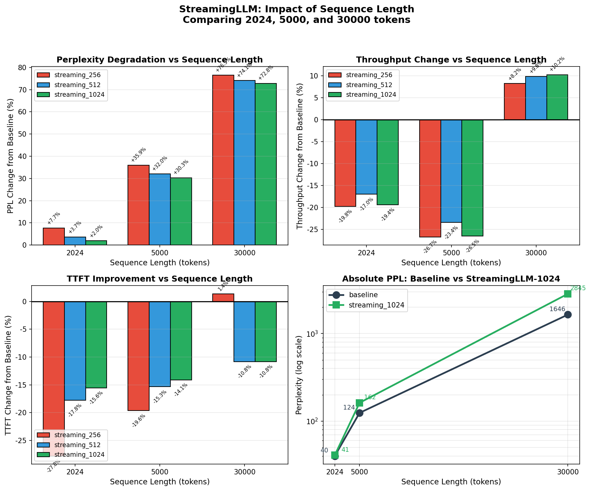
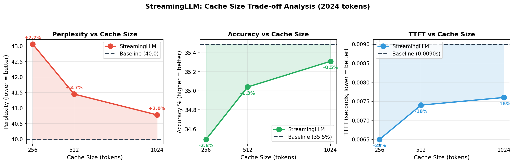
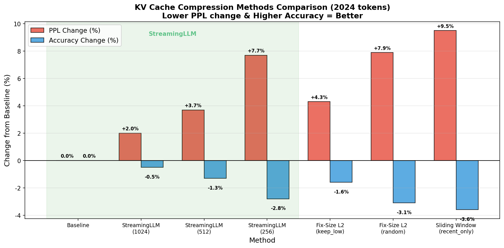
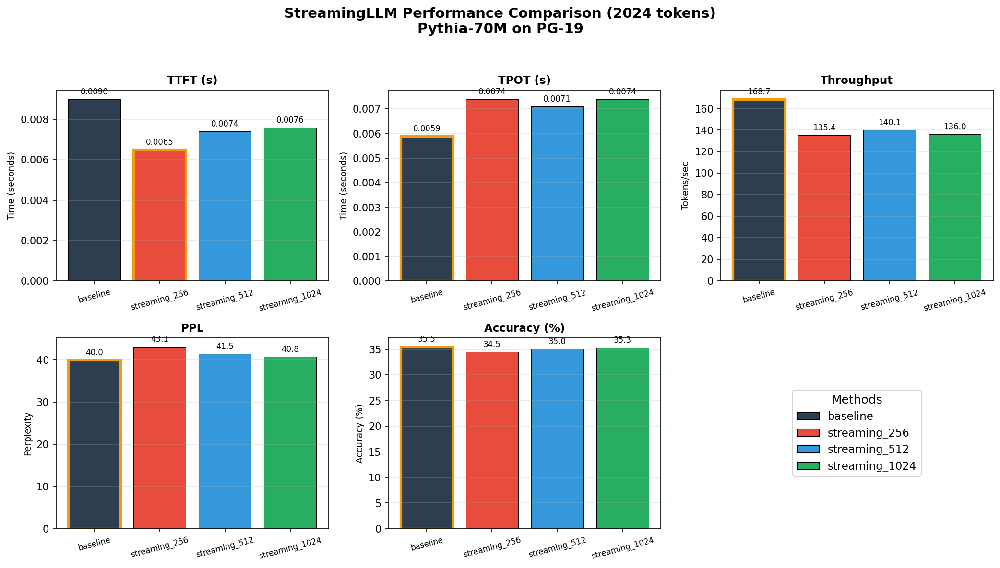

# StreamingLLM 性能分析报告

## 1. 方法概述

StreamingLLM 是 MIT Han Lab 提出的一种 KV Cache 压缩方法（ICLR 2024），核心思想是：

- **Attention Sink 现象**：LLM 会将大量 attention 分配给序列开头的 tokens（"attention sinks"），即使这些 tokens 语义上不重要
- **保留策略**：保留 initial tokens（attention sinks）+ 最近的 tokens（sliding window）
- **无需微调**：不需要额外训练，可直接应用于预训练模型

### Cache 结构

```
[initial tokens (0:start_size)] + [recent tokens (seq_len-recent_size:seq_len)]
```

默认配置：`start_size=4`（4 个 attention sink tokens）

## 2. 实验设置

### 模型与数据集
- **模型**: `EleutherAI/pythia-70m-deduped`（70M 参数）
- **数据集**: PG-19（长文本数据集）
- **设备**: Apple MPS
- **Skip layers**: [0, 1]

### 测试配置

| 配置名称 | start_size | recent_size | **实际 Cache 限制** |
|----------|------------|-------------|---------------------|
| baseline | - | - | 无限制（等于序列长度） |
| streaming_256 | 4 | 252 | **256** |
| streaming_512 | 4 | 508 | **512** |
| streaming_1024 | 4 | 1020 | **1024** |

> **注**：Cache 大小 = `start_size + recent_size`。结果中显示的 "Cache" 列是输入序列长度（如 2023），而非实际的 cache 限制。

## 3. 实验结果

### 3.1 短序列测试（2024 tokens, 10 samples）

| Method | TTFT (s) | TPOT (s) | Throughput | PPL | Accuracy |
|--------|----------|----------|------------|-----|----------|
| **baseline** | 0.0090 | 0.0059 | 168.71 | 39.99 | 35.49% |
| streaming_256 | 0.0065 | 0.0074 | 135.37 | 43.06 | 34.49% |
| streaming_512 | 0.0074 | 0.0071 | 140.05 | 41.45 | 35.04% |
| streaming_1024 | 0.0076 | 0.0074 | 136.03 | 40.78 | 35.31% |

**相对变化：**
| Method | TTFT 变化 | PPL 变化 | Accuracy 变化 |
|--------|-----------|----------|---------------|
| streaming_256 | **-27.8%** ✓ | +7.7% | -2.8% |
| streaming_512 | **-17.8%** ✓ | +3.7% | -1.3% |
| streaming_1024 | **-15.6%** ✓ | +2.0% | -0.5% |

> 注：TTFT 负值表示延迟降低（更快），PPL 正值表示困惑度上升（更差）

### 3.2 中等序列测试（5000 tokens, 5 samples）

| Method | TTFT (s) | TPOT (s) | Throughput | PPL | Accuracy |
|--------|----------|----------|------------|-----|----------|
| **baseline** | 0.0163 | 0.0083 | 123.30 | 124.28 | 26.19% |
| streaming_256 | 0.0131 | 0.0115 | 90.36 | 168.93 | 25.10% |
| streaming_512 | 0.0138 | 0.0106 | 94.40 | 164.10 | 25.46% |
| streaming_1024 | 0.0140 | 0.0110 | 90.58 | 161.96 | 25.66% |

**相对变化：**
| Method | TTFT 变化 | PPL 变化 | Accuracy 变化 |
|--------|-----------|----------|---------------|
| streaming_256 | **-19.6%** ✓ | +35.9% ⚠️ | -4.2% |
| streaming_512 | **-15.3%** ✓ | +32.0% ⚠️ | -2.8% |
| streaming_1024 | **-14.1%** ✓ | +30.3% ⚠️ | -2.0% |

### 3.3 长序列测试（30000 tokens, 10 samples, 20 warmup）

| Method | TTFT (s) | TPOT (s) | Throughput | PPL | Accuracy |
|--------|----------|----------|------------|-----|----------|
| **baseline** | 0.0074 | 0.0100 | 96.25 | 1646.10 | 10.97% |
| streaming_256 | 0.0075 | 0.0086 | **104.19** | 2906.07 | 10.30% |
| streaming_512 | 0.0066 | 0.0085 | **105.72** | 2865.64 | 10.43% |
| streaming_1024 | 0.0066 | 0.0085 | **106.10** | 2845.13 | 10.49% |

**相对变化：**
| Method | TTFT 变化 | Throughput 变化 | PPL 变化 | Accuracy 变化 |
|--------|-----------|-----------------|----------|---------------|
| streaming_256 | +1.4% | **+8.2%** ✓ | +76.5% ⚠️ | -6.1% |
| streaming_512 | **-10.8%** ✓ | **+9.8%** ✓ | +74.1% ⚠️ | -4.9% |
| streaming_1024 | **-10.8%** ✓ | **+10.2%** ✓ | +72.8% ⚠️ | -4.4% |

## 4. 关键发现

### 4.1 序列长度对性能影响



| 序列长度 | Baseline PPL | StreamingLLM-1024 PPL | PPL 增幅 | TTFT 改善 | 吞吐量变化 |
|----------|--------------|------------------------|----------|-----------|------------|
| 2024 | 39.99 | 40.78 | +2.0% ✓ | -15.6% | -19.4% |
| 5000 | 124.28 | 161.96 | +30.3% ⚠️ | -14.1% | -26.5% |
| 30000 | 1646.10 | 2845.13 | +72.8% ⚠️ | -10.8% | **+10.2%** |

### 4.2 核心观察

#### ✅ 优点

1. **TTFT 持续改善**：在所有序列长度下，TTFT 均有 10-28% 的提升
   
2. **长序列吞吐量优势**：在 30000 tokens 的长序列测试中，StreamingLLM 的吞吐量反而**高于** baseline（+8-10%）
   - 原因：固定大小的 KV Cache 减少了长序列的内存访问开销
   - 这是 StreamingLLM 的核心设计目标

3. **短序列质量损失可控**：2024 tokens 时，PPL 仅增加 2%

#### ⚠️ 注意事项

1. **长序列 PPL 显著恶化**：
   - 5000 tokens: PPL +30%
   - 30000 tokens: PPL +73%
   - 原因：丢失了大量中间上下文信息

2. **短序列吞吐量下降**：2024 tokens 时吞吐量下降约 19%
   - 原因：每步都需要进行 KV Cache 压缩操作
   - 在长序列中，这个开销被内存访问的节省所抵消

### 4.3 Cache Size 权衡



在相同 cache 大小限制下：
- **Cache 越大** → PPL 越接近 baseline，但 TTFT 改善越小
- **Cache 越小** → TTFT 改善越大，但 PPL 损失越严重

## 5. 与其他方法对比

基于同项目的 Fix-Size L2 压缩方法的实验结果（2024 tokens）：



| Method | PPL 变化 | Accuracy 变化 | 特点 |
|--------|----------|---------------|------|
| **StreamingLLM (1024)** | +2.0% | -0.5% | 简单高效，无需计算 |
| Fix-Size L2 (keep_low) | +4.3% | -1.6% | 需要计算 L2 范数 |
| Fix-Size L2 (random) | +7.9% | -3.1% | 随机驱逐 |
| recent_only (滑动窗口) | +9.5% | -3.6% | 最简单但效果最差 |

**结论**：在短序列场景下，StreamingLLM 的 attention sink 保留策略明显优于纯滑动窗口和 L2 范数方法。

## 6. 可视化

运行以下命令生成可视化图表：

```bash
python scripts/plot_streamingllm_results.py
```

### 6.1 各指标对比（短序列 2024 tokens）



### 6.2 Cache Size 权衡分析


### 6.3 序列长度影响


### 6.4 与其他方法对比


## 7. 推荐配置

| 应用场景 | 推荐配置 | 理由 |
|----------|----------|------|
| **短文本、质量优先** | streaming_1024 | PPL +2%, Acc -0.5%，几乎无损 |
| **短文本、速度优先** | streaming_512 | TTFT -18%，PPL +3.7%，较好平衡 |
| **超长文本流式处理** | streaming_512/1024 | 吞吐量反而提升 8-10% |
| **内存极度受限** | streaming_256 | TTFT -28%，但质量损失大 |

## 8. 局限性分析

### 8.1 长序列 PPL 恶化原因

StreamingLLM 的核心假设是：
- attention sink tokens 足够稳定模型输出
- 最近的 tokens 提供足够的上下文

但在长序列中：
- 中间信息（recent_size 到 seq_len-recent_size）完全丢失
- 这导致模型无法利用长距离依赖

### 8.2 适用场景

**✅ 适用：**
- 实时对话/流式应用
- 无限长度文本生成（如代码补全）
- 内存受限环境

**❌ 不适用：**
- 需要全局上下文的任务（长文档摘要、问答）
- 对生成质量要求高的场景

## 9. 结论

1. **StreamingLLM 的核心价值**：在超长序列场景下实现稳定的吞吐量，避免 OOM

2. **短序列表现**：TTFT 改善显著（15-28%），PPL 损失可控（2-8%）

3. **长序列表现**：
   - ✅ 吞吐量提升 8-10%
   - ✅ TTFT 改善 10%
   - ⚠️ PPL 恶化 70%+（但模型仍可运行，不会崩溃）

4. **vs 其他方法**：在固定 cache 大小下，StreamingLLM 的质量损失最小

## 参考文献

- Xiao et al., "Efficient Streaming Language Models with Attention Sinks", ICLR 2024
- https://github.com/mit-han-lab/streaming-llm
